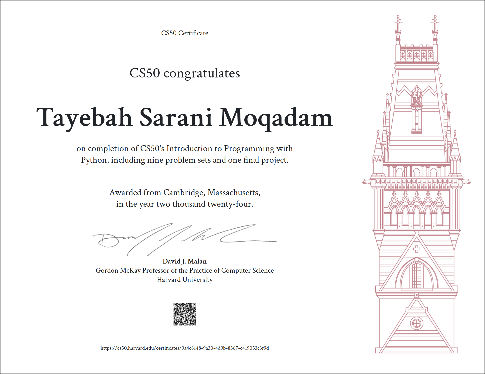

### **README for CS50x - Harvard's Introduction to Computer Science**

---

## **Course Overview:**

CS50x, Harvard's Introduction to Computer Science, is a rigorous and comprehensive introduction to computer science and programming. It covers the fundamentals of computer science and provides a strong foundation for further study in the field. The course is designed for both beginners and those with some programming experience. Throughout the course, you will learn how to think algorithmically and solve problems efficiently. 

## **Course Contents:**

### 1. **Introduction to Computer Science:**
   - **Overview of Computer Science:** Learn the basics of computer science, its history, and its key concepts.
   - **Understanding Computational Thinking:** Develop the ability to approach problems with an algorithmic mindset.
  
### 2. **C Programming:**
   - **Basics of C Programming:** Learn syntax, variables, data types, control structures (if, else, loops), functions, arrays, and pointers.
   - **Memory Management:** Understand how memory works, how to allocate and free memory, and how to avoid common pitfalls like memory leaks.
   - **Algorithms in C:** Implement algorithms like searching, sorting, and basic data structures (like arrays and linked lists).

### 3. **Algorithms:**
   - **Big O Notation:** Understand time and space complexity and how to analyze the efficiency of algorithms.
   - **Sorting and Searching Algorithms:** Learn about quicksort, merge sort, binary search, and other important algorithms.
   - **Graph Algorithms:** Explore graph traversal techniques like breadth-first search (BFS) and depth-first search (DFS).

### 4. **Data Structures:**
   - **Linked Lists:** Understand how to create, manage, and manipulate linked lists.
   - **Stacks and Queues:** Learn these essential data structures and how they are used in problem-solving.
   - **Hash Tables:** Understand hashing and how hash tables are used for fast data retrieval.
   - **Trees:** Learn how to implement and work with binary trees and other tree structures.

### 5. **Web Development:**
   - **HTML, CSS, and JavaScript:** Learn the basics of web development, including front-end technologies.
   - **Backend Development:** Learn server-side programming, databases, and the basics of building web applications using Flask (Python).
   - **API Integration:** Understand how to work with APIs and make your web apps interactive.

### 6. **Databases:**
   - **SQL (Structured Query Language):** Learn how to create and manage databases, write queries, and manipulate data in SQL.
   - **Normalization:** Understand how to design databases to avoid redundancy and ensure efficient data management.
   - **Relational Databases:** Learn how databases are structured and how to manage relationships between tables.

### 7. **Security:**
   - **Encryption and Cryptography:** Learn about the fundamentals of cryptography and how encryption is used to secure data.
   - **Web Security:** Understand common web vulnerabilities (like SQL injection and cross-site scripting) and how to protect your applications.

### 8. **Final Projects:**
   - **Capstone Projects:** Towards the end of the course, you will work on your own project to demonstrate the skills and concepts you have learned.
   - **Project Submission and Evaluation:** Submit your project for peer review and receive feedback from instructors and peers.

---

## **Skills Learned:**
- Strong foundation in **C programming** and **algorithm design**.
- Deep understanding of **data structures** and **algorithms**.
- Practical experience with **web development**, including both front-end and back-end.
- Proficiency in **SQL** and **databases**.
- Understanding of **computer security** and encryption.
- The ability to tackle complex problems using **computational thinking**.

---

## **Project and Assessment:**
The course includes a series of problem sets and assignments designed to reinforce the material. The final project gives you the opportunity to apply what you've learned to a real-world project of your choice.

---

## **Conclusion:**
CS50x is a challenging and rewarding course that gives students a comprehensive introduction to computer science. It equips you with the tools to understand and solve computational problems and provides a solid foundation for further studies in the field. 

---
